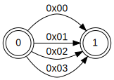
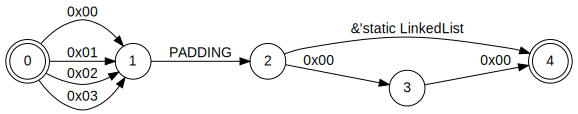

+++
title = "Safety Goggles for Alchemists"
date = 2024-09-30
tags = ["rust", "transmute"]
+++

***The Path Towards Safer Transmute***

Since Rust’s inception, `mem::transmute` has been the poster-dragon of unsafe code, but its reign of error is coming to an end! In this ~~talk~~ blog post, you’ll learn how Rust is poised to become the first systems programming language with transmutation safety, and how safe transmute is already being put to use to build next-gen systems.

<!-- more -->

> *(This is an adaption of my RustConf 2024 talk of the same name. Being a talk adaptation, this blog post is a little more narrative and conversational than my usual fare. A video of the talk will be available soon!*)

## History

As you might know, when Graydon Hoare presented Rust at the Mozilla Annual Summit in 2010, [his opening slide](http://venge.net/graydon/talks/intro-talk.pdf) described the project as "*Technology from the past come to save the future from itself.*" This tagline has usually understood as a nod to [Rust's influences](https://doc.rust-lang.org/reference/influences.html), which include Scheme (1975), StandardML (1983), and Cyclone (2001).

But to *really* understand Rust's roots, we need to turn the clock back a little further, to 1379.

That year, famed bookseller Nicholas Flamel — so the story goes — translated the cryptic tome of Abremelin the Mage. With its occult insights, Flamel transmuted lead into gold, and, some say, achieved immortal life.

Whether Flamel took his secrets to the grave, or assumed a false identity, I cannot say. All I do know is that nearly six hundred years later, *another* beareded man began contributing to an upstart programming language called Rust.


This is "[Brian Anderson](https://brson.github.io/)", and in July 2012, he [added a curious new function to Rust](https://github.com/rust-lang/rust/commit/f12adcbf930122ef6d98790b53d80d511dc62406) called `transmute`:
```rust
unsafe fn transmute<Src, Dst>(src: Src) -> Dst {
    ...
}
```

Transmute is an `unsafe` function that consumes a source value of any type and returns a value of any type of your chosing, backed by those same bits. With it, Rust, too, can turn lead into gold:
```rust
struct Lead;
struct Gold;

let gold: Gold = unsafe { transmute(Lead) };
```
...and, *perhaps*, gain immortality.

## Dangers
But, with great power, comes equally great danger. There are many risks to transmutation, this section will cover the four you need to worry about (unless you're transmuting [dynamically sized types](https://doc.rust-lang.org/reference/dynamically-sized-types.html) or [function pointers](https://doc.rust-lang.org/reference/types/function-pointer.html)).

#### 1. Bit Validity

Foremost, the source value must be a bit-valid instance of the destination type. Consider this transmutation from `u8` to `bool`:
```rust
fn u8_to_bool(src: u8) -> bool {
    unsafe { core::mem::transmute(src) }
}
```

The layout of a `u8` is a single, initialized byte of any value. The layout of a `bool` is a single, initialized byte with the value of either zero or one.

The above function, therefore, is sound to invoke only with `0` or `1`. What happens if you pass in a `2`? [Undefined behavior!](https://raphlinus.github.io/programming/rust/2018/08/17/undefined-behavior.html) Rust programs **must never** exhibit undefined behavior.

#### 2. Alignment

Next, if references are involved, you need to worry about at least two things in addition to their bit validity. The first is reference alignment. 

Types in Rust have [alignment requirements](https://doc.rust-lang.org/reference/type-layout.html#size-and-alignment). Whereas `u8`s can appear at any memory address, `u16`s can only appear at even memory addresses on most platforms.

Given this, invoking the below function, which transmutes a reference to two `u8`s into a reference to a `u16`:
```rust
fn u8s_to_u16(src: &[u8; 2]) -> &u16 {
    // UNSOUND!
    unsafe { transmute::<&[u8; 2], &u16>(src) }
}
```
...will be sound about half the time.

#### 3. Lifetimes

And of course, wherever there are references, there are lifetimes. It’s trivial to use transmute to extend a reference with a bounded lifetime into a reference with a static lifetime: 

```rust
fn extend<'a, T>(src: &'a T) -> &'static T {
    unsafe { core::mem::transmute(src) }
}
```

Although there are valid use-cases for this, it’s easy to accidentally end up with a dangling reference and that, of course, is undefined behavior.

#### 4. Safety Invariants

Finally, most subtle of all, you need to worry about violating your own safety invariants. Let’s say one person on your team defines a struct that holds even numbers:

```rust
#[repr(transparent)]
pub struct Even {
    // SAFETY: Always an even number!
    n: u8
}
```
...and then elsewhere, you bypass that constructor with `transmute`
```rust
fn u8_to_even(src: u8) -> Even {
    // POTENTIALLY UNSOUND!
    unsafe { transmute::<u8, Even>(src) }
}
```
Unless you’ve guaranteed that your source value upholds all the safety invariants of the destination type, this is potentially unsound!

Although this example might seem contrived (it is), this is the safety story of Rust's `str` type, which [carries a library-level invariant that its backing bits are valid UTF-8](https://doc.rust-lang.org/std/primitive.str.html#invariant).

## Why Transmute? A Case Study
Given these risks, why bother with transmutation at all? As a case study, let’s consider a simplified scenario of parsing UDP packets. A UDP header looks something like this:

```
 0      7 8     15 16    23 24    31  
+--------+--------+--------+--------+ 
|     Source      |   Destination   | 
|      Port       |      Port       | 
+--------+--------+--------+--------+ 
|                 |                 | 
|     Length      |    Checksum     | 
+--------+--------+--------+--------+ 
|                                     
|          data octets ...            
+---------------- ...                 

     User Datagram Header Format
```
Two bytes for the source port, another two for the destination port, another two for the length, two for the checksum, and then the data follows.

### Traditional Packet Parsing

A traditional parser for this format might look something like this:

```rust
struct UdpPacketHeader {
    src_port: u16,
    dst_port: u16,
    length  : u16,
    checksum: u16,
}

fn read_header(bytes: &[u8]) -> Option<UdpPacketHeader> {
    let (&src_port, bytes) = bytes.split_first_chunk()?;
    let (&dst_port, bytes) = bytes.split_first_chunk()?;
    let (&length,   bytes) = bytes.split_first_chunk()?;
    let (&checksum, bytes) = bytes.split_first_chunk()?;
    
    Some(UdpPacketHeader { 
        src_port: u16::from_be_bytes(src_port),
        dst_port: u16::from_be_bytes(dst_port),
        length:   u16::from_be_bytes(length),
        checksum: u16::from_be_bytes(checksum),
    })
}
```
The `read_header` function here consumes a slice of bytes, and reads by-value the four two-byte chunks that comprise the header's fields.


This is all well-and-good (elegant, even!), but with `transmute` we can do better.

### Zero-Copy Packet Parsing
First, with very little effort, we can redefine `UdpPacketHeader` so that its layout in memory matches the wire layout of a UDP packet header:
```rust
#[repr(C)] // <- Add `repr(C)`
struct UdpPacketHeader {
    src_port: [u8; 2], // <- Use `[u8; 2]` instead
    dst_port: [u8; 2], //        of `u16` to avoid
    length  : [u8; 2], //           aforementioned
    checksum: [u8; 2], //         alignment issues.
}
```
Then, we can define a function that, like `read_header`, that consumes a slice of input bytes but instead returns an optional *reference* to a `UdpPacketHeader`:
```rust
fn view_header(bytes: &[u8]) -> Option<&UdpPacketHeader> {
    const N: usize = mem::size_of::<UdpPacketHeader>();
    let bytes = <&[u8; N]>::try_from(bytes).ok()?;
    Some(unsafe { mem::transmute(bytes) })
}
```
This works by first checking that there are enough `bytes` to parse a `UdpPacketHeader` and then, if so, transmuting the `&[u8; size_of::<UdpPacketHeader>()]` to `&UdpPacketHeader`.

Not only did this require far fewer lines of code than `read_header`, it also optimizes down to a small fraction of the machine code ([Godbolt](https://rust.godbolt.org/z/jhPo6G7cE)):
```=
view_header:
        xor     eax, eax
        cmp     rsi, 8
        cmove   rax, rdi
        ret
```
By comparison, `read_header` optimizes to this ([Godbolt](https://rust.godbolt.org/z/Kcj37fsY9)):
```=
read_header:
        cmp     rsi, 2
        jae     .LBB0_2
        xor     eax, eax
.LBB0_3:
        xor     ecx, ecx
.LBB0_4:
        or      rax, rcx
        ret
.LBB0_2:
        mov     rcx, rsi
        and     rcx, -2
        xor     eax, eax
        cmp     rcx, 2
        je      .LBB0_3
        and     rsi, -4
        mov     ecx, 0
        cmp     rsi, 4
        je      .LBB0_4
        movzx   eax, word ptr [rdi]
        movzx   ecx, word ptr [rdi + 2]
        movzx   esi, word ptr [rdi + 4]
        movzx   edx, word ptr [rdi + 6]
        rol     ax, 8
        rol     cx, 8
        rol     si, 8
        rol     dx, 8
        movzx   ecx, cx
        movzx   esi, si
        shl     rsi, 48
        shl     rcx, 32
        shl     eax, 16
        or      rax, rcx
        or      rax, rsi
        mov     ecx, 1
        or      rax, rcx
        ret
```
(And if our packet had more fields, the amount of machine code would scale with them. By contrast, all that would change in the machine code for `view_header` is the constant `8`.)

Of course, zero-copy parsing remains tremendously dangerous. What if we forgot to mark `UdpPacketHeader` with `repr(C)`? What if we forgot to change its fields to `[u8; 2]`? What if we miscalculated `N`? The penalty of getting any of these details wrong is unsoundness, and trusting individual programmers to get them right in a large codebase isn't tenable.

### Interlude: Safe Transmutation Crates
The response to challenge in Rust community has been the creation of various crates that safely abstract over transmutation. The two major players in this area are [bytemuck](https://crates.io/crates/bytemuck) and [zerocopy](https://crates.io/crates/zerocopy). (I'll pick on zerocopy, since I co-maintain it.)

Zerocopy (and bytemuck) work by defining marker traits; e.g., [`FromBytes`](https://docs.rs/zerocopy/0.8.0-alpha.26/zerocopy/trait.FromBytes.html):
```rust
/// Types for which any bit pattern is valid.
///
/// # Safety
///
/// If `T: FromBytes`, then unsafe code may assume
/// that it is sound to produce a T whose bytes are
/// initialized to any sequence of valid `u8`s (in other
/// words, any byte value which is not uninitialized).
/// If a type is marked as `FromBytes` which violates
/// this contract, it may cause undefined behavior.
unsafe trait FromBytes { … }
```
These marker traits are `unsafe`, denoting both that they carry invariants which you must prove to be true when implementing them, and which you can rely on while writing unsafe code.

For each trait, these crates typically provide a comprehensive set of base implementations over primitive types; e.g.:
```rust
unsafe impl FromBytes for f32 {}
unsafe impl FromBytes for f64 {}
unsafe impl FromBytes for i8 {}
unsafe impl FromBytes for i16 {}
unsafe impl FromBytes for i32 {}
unsafe impl FromBytes for i64 {}
unsafe impl FromBytes for i128 {}
unsafe impl FromBytes for isize {}
/* and so on */
```
Note that while all primitive numbers are `FromBytes`, types like `bool` and `char` are not because they have bit-validity invariants.

To support compound types, these crates combine inductive reasoning and additional checks. For example, a struct or tuple is `FromBytes` if its fields are all `FromBytes`; e.g.:

```rust
unsafe impl FromBytes for (A, B)
where
    A: FromBytes,
    B: FromBytes,
{}
/* and so on */
```

Fortunately, as a user, you don’t need to remember any of these rules or write unsafe code yourself. Both bytemuck and zerecopy provide proc macro derives for their marker traits.


So, if we apply zerocopy to our packet parsing problem, we don't have to write any `unsafe` code at all. We just derive the right traits, and call the safe methods they provide:
```rust
// (using zerocopy 0.8)
use zerocopy::{FromBytes, Immutable, KnownLayout};
use zerocopy::byteorder::network::U16;

#[derive(FromBytes, Immutable, KnownLayout)]
#[repr(C)]
struct UdpPacketHeader {
    src_port: U16,
    dst_port: U16,
    length  : U16,
    checksum: U16,
}

fn view_udp_packet(bytes: &[u8]) -> Option<&UdpPacketHeader> {
    UdpPacketHeader::ref_from_bytes(bytes).ok()
}
```

### The Fuchsia Networking Stack

At Google, engineers working on their new [Fuchsia operating system](https://fuchsia.dev/), used the zerocopy crate to [build a networking stack](https://fuchsia.dev/fuchsia-src/contribute/roadmap/2021/netstack3) that parses and serializes packets almost entirely in-place and achieved this feat almost bug-free.

If you’re curious about how they accomplished this feat, I’d encourage you to watch Josh Liebow-Feeser’s RustConf talk, *Safety in an Unsafe World* ([slides here](https://joshlf.com/files/talks/Safety%20in%20an%20Unsafe%20World.pdf)).

Suffice to say, the zerocopy crate provided the foundational abstractions that made this possible.

## Introducing Project Safe Transmute

However, zerocopy has a dity secret: it’s backed by nearly *fourteen thousand* lines of subtle unsafe code and safety comments.

This is ridiculous. The compiler already knows about the layouts of types, so why is the onus entirely on you to reason about them in the context of transmute? Why can’t the compiler use its knowledge to tell you when one type is transmutable into another?

And remember, zerocopy only solves the limited problems of safe transmutes into bytes, and from bytes. If state-of-the-art networking stacks can be built by solving this limited problem, what might be possible by solving transmutability between *arbitrary* types?

These are the questions that motivated the creation of [*Project Safe Transmute*](https://rust-lang.github.io/rfcs/2835-project-safe-transmute.html), which hopes to provide new, safer alternatives that can replace *every* use `mem::transmute` and pointer casting.

## Theory of Alchemy
To begin to do so, we had to develop a theory of type alchemy. The general idea is quite straightforward: *A type, `Src`, is transmutable into a type, `Dst`, if every possible value of `Src` is a valid value of `Dst`.*

At first glance, this sounds like a simple problem of sets and subsets. For example, we can think of the layout of a `u8` as being the set of all initialized bytes ranging from `0` to `255`: 

```
layout(u8) = {0x00, ... 0xFF}
```

...and the layout of a `NonZeroU8` as being all values ranging from `1` to `255`:
```
layout(NonZeroU8) = {0x01, ... 0xFF}
```

Given this, we can say that `NonZeroU8` is transmutable into `u8` because its layout is a subset of that of u8, and that the reverse is not transmutable, because `u8` is not a subset of `NonZeroU8`:

```
layout(NonZeroU8) ⊆ layout(u8)
layout(NonZeroU8) ⊉ layout(u8)
```

But this representation is extraordinarly computationally expensive. If a type is a single byte, its layout is a set of at most 256 elements. But as the size of the type grows, the maximum size of its layout set grows exponentially:

```
|layout(u8)|  = 2^8  = 256
|layout(u16)| = 2^16 = 65,536
|layout(u32)| = 2^32 = 4,294,967,296
|layout(u64)| = 2^64 = 18,446,744,073,709,551,616
```

Worse, types are not always finite; e.g.:

```rust
struct LinkedList<T> {
    head: T,
    tail: Option<Box<T>>,
}
```
A linked list does not have bounded size at compile time, and we can't simply ignore its `tail` for the purpose of analyzing transmutability.

### Types are Automata!
Fortunately, there’s another way we can view types: as finite automata: The layout of a type is a finite automaton, in which each edge represents a validity constraint, and each path of edges from start to finish represents a particular possible value of the type.

For example, this `Direction` enum has four possible values:
```rust
#[repr(u8)]
enum Direction {
    North = 0x00,
    East  = 0x01,
    South = 0x02,
    West  = 0x03,
}
```
and, accordingly, there are four paths through its corresponding automaton:



This representation is also extremely expressive. In addition to bit values, edges can encode uninitialized bytes (e.g., from padding), and references. For example, a `LinkedList` of `Direction`s:

```rust
#[repr(C)]
struct LinkedList {
    head: Direction,
    tail: Option<&'static Self>,
}

#[repr(u8)]
enum Direction {
    North,
    East,
    South,
    West
}
```

...would look something like this on a 16-bit target:



Crucially, this representation scales gracefully. Although the number of total paths through an array `[Direction; N]` still scales exponentially with respect to `N`, the total number of *edges* scales linearly!

And best yet, this structured representation lends itself to a polynomial-time analysis of transmutability: We simply construct the layout graphs of the source and destination types, and perform a memoized, depth-first check that every path through the source type has a matching path through the destination type.

## Creating Safety Goggles for Alchemists

Thanks to these insights, solving transmutability for arbitrary types is both theoretically possible and practical to implement. So we implemented it!

[`TransmuteFrom`](https://doc.rust-lang.org/nightly/core/mem/trait.TransmuteFrom.html) is an `unsafe` marker trait which is automatically implemented by the compiler, on-the-fly, for any two types that are transmutable:
```rust
unsafe trait TransmuteFrom<Src: ?Sized> {
    fn transmute(src: Src) -> Dst
    where
        Src: Sized,
        Self: Sized;  
}
```
With this trait, our examples of unsoundness become compilation errors. Let’s revisit our examples from earlier.

#### 1. Bit Validity Errors
If we rewrite our bit validity example to use this trait and method:
```rust
fn u8_to_bool(src: u8) -> bool {
    TransmuteFrom::transmute(src) // Error!
}
```
...it fails to compile. And the compilation error explains exactly why:
```
error[E0277]: `u8` cannot be safely transmuted into `bool`
 --> src/lib.rs:3:30
  |
4 |     TransmuteFrom::transmute(src)
  |     ------------------------ ^^^ at least one value of
  |     |                            `u8` isn't a bit-valid
  |     |                            value of `bool`
  |     required by a bound introduced by this call
```

#### 2. Alignment Errors
And if we attempt a reference transmutation that might have alignment issues:
```rust
fn u8s_to_u16(src: &[u8; 2]) -> &u16 {
    TransmuteFrom::transmute(src) // Error!
}
```
...we’ll get an error message telling us exactly that:
```
error[E0277]: `&[u8; 2]` cannot be safely transmuted into `&u16`
 --> src/lib.rs:3:30
  |
4 |     TransmuteFrom::transmute(src)
  |     ------------------------ ^^^ the minimum alignment of
  |     |                            `&[u8; 2]` (1) should be
  |     |                            greater than that of
  |     |                            `&u16` (2)
  |     required by a bound introduced by this call
```

#### 3. Lifetimes Errors
And if we try to extend the lifetime of a reference:
```rust
fn extend<'a, T>(src: &'a T) -> &'static T {
    TransmuteFrom::transmute(src) // Error!
}
```
that, too, is a compilation error:
```
error: lifetime may not live long enough
 --> src/lib.rs:3:5
  |
1 | fn extend<'a>(src: &'a u8) -> &'static u8 {
  |           -- lifetime `'a` defined here
2 |     // compile error!
3 |     TransmuteFrom::transmute(src)
  |     ^^^^^^^^^^^^^^^^^^^^^^^^^^^^^ returning this value
  |                                   requires that `'a`
  |                                   must outlive `'static`
```

#### 4. Safety Invariant Errors
And finally, if we violate the safety invariants of user-defined types:
```rust
#[repr(transparent)]
pub struct Even {
    // SAFETY: Always an even number!
    n: u8
}

fn u8_to_even(src: u8) -> Even {
    TransmuteFrom::transmute(src) // Error!
}
```
...that, too, is a compilation error:
```
error[E0277]: `u8` cannot be safely transmuted into `Even`
 --> src/lib.rs:3:30
  |
4 |     TransmuteFrom::transmute(src)
  |     ------------------------ ^^^ `Even` may carry
  |     |                            safety invariants
  |     |
  |     required by a bound introduced by this call
```

But, wait: Rust doesn't yet have any notion of `unsafe` fields. How can `TransmuteFrom` possibly know that `Even` has safety invariants? 

It doesn't. It can't. Any user-defined type might have safety invariants, so the only sound thing to do (for now) is assume they *all* have safety invariants.

### Take 2: Saf*er* Transmutation

[`TransmuteFrom`]: https://doc.rust-lang.org/nightly/std/mem/trait.TransmuteFrom.html

It turns out, “Safe” transmutation isn’t all that useful. What you really need, for most real-word applications, is safer transmutation.

So we built an escape hatch into [`TransmuteFrom`], an extra parameter called `ASSUME`:

```rust
unsafe trait TransmuteFrom<Src: ?Sized, const ASSUME: Assume> {
    unsafe fn transmute(src: Src) -> Dst
    where
        Src: Sized,
        Self: Sized;  
}


struct Assume {
    alignment: bool,
    lifetimes: bool,
    safety:    bool,
    validity:  bool,
}
```

`ASSUME` lets you tell the compiler which safety properties it should assume that you, the programmer, are taking care of ensuring.

In essence, it lets you relax the compile-time checks of [`TransmuteFrom`], so long as you promise to do those checks yourself.

Let's revisit some of our earlier examples again, this time using `Assume`.

#### Assume Bit Validity

For example, let’s again consider transmuting a `u8` to a `bool`. Sure, this transmutation is invalid for most values of u8, but not for all values of `u8`. If we tell the compiler to assume validity:

```rust
fn u8_to_bool(src: u8) -> bool {
    assert!(src < 2);
    unsafe { TransmuteFrom::<_, Assume::VALIDITY>::transmute(src) }
}
```

...it will accept this transmutation instead of emitting a compilation error.

#### Assume Alignment

Likewise, if we tell the compiler to assume that we’ve ensured alignment:

```rust
fn u8s_to_u16(src: &[u8; 2]) -> &u16 {
    assert!(<*const _>::is_aligned_to(src, align_of::<u16>()));
    unsafe { TransmuteFrom::<_, Assume::ALIGNMENT>::transmute(src) }
}
```

...it will let us transmute between references with potentially incompatible alignment requirements, again, assuming that we’ve done the work of guaranteeing that alignment is actually satisfied — in this case with a runtime check.

#### Assume Safety Invariants

And finally, if tell [`TransmuteFrom`] to assume safety:
```rust
#[repr(transparent)]
pub struct Even {
    // SAFETY: Always an even number!
    n: u8
}

fn u8_to_even(src: u8) -> Even {
    assert!(src % 2 == 0)
    unsafe { TransmuteFrom::<_, Assume::SAFETY>::transmute(src) }
}
```

...it will let us do transmutations that could violate the safety invariants of the involved types, enabling [`TransmuteFrom`] to accept transmutations involving user-defined types.

## Using [`TransmuteFrom`]
This trait, which [is available for testing right now on nightly][`TransmuteFrom`], provides effective safety goggles for folks doing transmutations and, especially, for abstracting over transmutation.

### Writing `SAFETY` Comments
For one-off transmutations, `ASSUME` tells you exactly what you need to write in your safety comment. For example, if we assume alignment and validity, that’s our cue that our safety comment needs to justify why both these safety conditions are satisfied; e.g.:
```rust
// SAFETY: We have checked that:
// 1. `src` validly aligned for `Dst` because...
// 2. `src` is a bit-valid instance of `Dst` because...
unsafe {
    TransmuteFrom::<_, { 
        Assume::ALIGNMENT.and(Assume::VALIDITY)
    }>::transmute(src)
}
```

### Building Safe Abstractions
Moreover, we see this truly versatile foundation for abstractions over transmute. Recall zerocopy's `FromBytes` trait:
```rust
/// # Safety
///
/// By implementing this, you guarantee that `Self`
/// can be transmuted from arbitrary init bytes.
///
/// Unsafe code may assume that `Self` has no
/// bit validity invariants.
pub unsafe trait FromBytes
{}
```
Judging whether a given type is soundly `FromBytes` is often a substantial, non-trivial exercise.

With [`TransmuteFrom`], the onus for proving this safety burden moves entirely from the programmer to the compiler, just by adding a `where` bound:

```rust
/// # Safety
///
/// By implementing this, you promise that
/// `Self` has no safety invariants.
///
/// Unsafe code may assume that `Self` has no
/// bit validity invariants.
pub unsafe trait FromBytes: Sized
where
    Self: TransmuteFrom<[u8; size_of::<Self>()], { Assume::SAFETY }>
{}
```

Given this, it’s with little exaggeration that think we can get zerocopy’s 14,000 lines of code down to about 1,400. 

## Future Outlook

There are a few remaining pieces of design and development work needed to get safe transmute over the finish line.

### Support for DSTs

Foremost, to fully support crates like zerocopy, we need to support dynamically sized types. The previous `where`-bound demonstration required adding `Sized` bounds to zerocopy's marker traits. However, zerocopy doesn't have `Sized` bounds, nor does it want to add them!

To fully support zerocopy, we would like to be able to rewrite that `where` bound like this:

```rust
pub unsafe trait FromBytes
where
    Self: TransmuteFrom<[u8], { Assume::SAFETY }>
{}
```

...using `[u8]` instead of `[u8; size_of::<Self>()]`.

In such cases, the compiler will imagine a DST instantiated to be of sufficiently great length to fill the destination type, and perform a transmutability analysis with that imagined type.

### Fallible Transmutation

Next, is fallible transmutation. Sure, with `Assume` we can tell the compiler to assume we’re taking care of doing certain checks. For example, with `Assume::VALIDITY`, the compiler will let us transmute a `u8` to a `bool`, but the onus is on us to correctly implement that runtime check on the source value; e.g.:
```rust
fn u8_to_bool(src: u8) -> bool {
    assert!(src < 2);
    // SAFETY: We have checked that `src` is a bit-valid
    // instance of `bool`.
    unsafe {
        TransmuteFrom::<_, Assume::VALIDITY>::transmute(src)
    }
}
```

But what if the compiler could do this for us, as well? Perhaps we could have a complementary `TryTransmuteTrait` with a `try_transmute` associated function that would automatically codegen the necessary runtime checks; e.g.:

```rust
fn u8_to_bool(src: u8) -> Option<bool> {
    TryTransmuteFrom::try_transmute(src)
}
```

This would further reduce the risk of user error resulting in undefined behavior.

### Critical Optimizations

To reduce the compile-time cost of using [`TransmuteFrom`], we need to implement a variety of optimizations to our implementation. We need to avoid recursion, migrate to a denser memory representation of layouts, and implement a run-length-encoding optimization so we can support very large arrays efficiently.

### Portability and Stability

Although [`TransmuteFrom`] effectively solves the problem of transmutation *safety*, some (but not all) use-cases of transmutation are also concerned with portability and SemVer stability. These are substantial challenges in their own right.

Rust provides very little in the way of layout portability. For example, the alignments of primitive integers vary between platforms, and this can have downstream effects on the soundness of pointer casts. We have some ideas of how to solve this, including the possibility of a marker trait automatically implemented for types whose memory representation is consistent across targets and compiler versions.

Relatedly, we also plan to investigate the potential of reflecting the SemVer stability of type layouts and transmutation into the type system. This is a remarkably difficult problem, with myriad answers that are clear, simple, and wrong. What does it mean to promise layout stability in the absence of portability? What does it mean for a crate author to promise transmutability in the absence of a closed set of types?

### RFC and Stabilization

In the tradition of Project Safe Transmute, we'll likely first focus on landing [`TransmuteFrom`], and then begin to iterate on solutions to these related problems (`TryTransmuteFrom`, stability and portability) in the crate ecosystem. We've already [begun prototyping a design for `TryTransmuteFrom` in zerocopy](https://docs.rs/zerocopy/0.8.0-alpha.26/zerocopy/trait.TryFromBytes.html).

Landing [`TransmuteFrom`] will require testing, feedback, an RFC, and — most importantly — your support. If all goes well, I can see us making the [`TransmuteFrom`] RFC in 2025.

### Closing Words

If any of this happens, it will be thanks to the support of community members like you — and all the phenomenal collaborators who’ve helped us get this far:

- You! Yes, You!
- Ryan Levick
- Josh Liebow-Feeser
- Lokathor
- Eli Rosenthal
- Michael Goulet
- Oli Scherer
- Bryan Garza

Thank you!